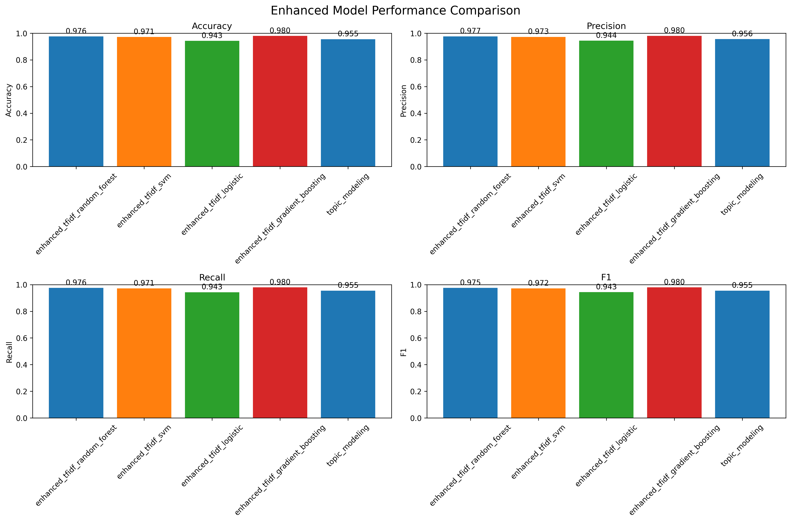
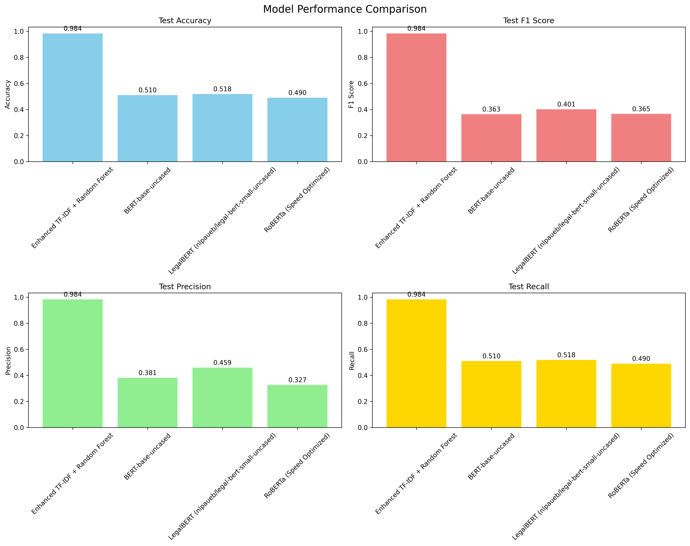

# Document Classifier

FastAPI-powered document classifier with explainability. It supports raw text and file uploads (PDF/DOC/DOCX with OCR fallback).

## Quick links

- Docker image (latest): https://hub.docker.com/r/pryyyynz/document-classifier
- Try it in the browser (Gradio on Hugging Face): https://huggingface.co/spaces/pryyyynz/contract-classifier

## What’s inside

- API: `FastAPI` app exposing health, single/batch prediction, and CSV export
- Explainability: LIME-based highlights for important phrases
- Classic NLP models: Enhanced TF‑IDF + (Random Forest, SVM, Logistic, Gradient Boosting), Topic Modeling
- Transformer baselines: BERT, LegalBERT, RoBERTa (with training outputs and plots)
- Reproducible outputs: Stored metrics, plots, and serialized models under `enhanced_models_output/` and `transformer_models_output/`

## Run with Docker

The image exposes port 8000 and serves with Uvicorn.

```bash
# Pull
docker pull pryyyynz/document-classifier:latest

# Run (maps host port 8000)
docker run --rm -p 8000:8000 pryyyynz/document-classifier:latest

# Open the docs
# http://localhost:8000/docs
```

Notes
- Model packaged by default: `enhanced_tfidf_gradient_boosting_model.pkl`.

## Try online

No install needed—use the hosted demo:
- Hugging Face Space: https://huggingface.co/spaces/pryyyynz/contract-classifier

## Local development setup

Prerequisites
- Python 3.10+
- System packages (for OCR and document parsing):

```bash
sudo apt-get update -y && sudo apt-get install -y \
	tesseract-ocr antiword poppler-utils libgl1
```

Install Python dependencies and run the API

```bash
python -m venv .venv && source .venv/bin/activate
pip install -r requirements.txt

# Option 1: Uvicorn module form (same as Docker CMD)
python -m uvicorn api.main:app --host 0.0.0.0 --port 8000

# Option 2: Helper script (installs deps, waits for /health, streams logs)
./run_api.sh
```

Open http://localhost:8000/docs

## API overview

Base URL: `http://localhost:8000`

- GET `/health`: Service and model status
- GET `/`: Basic info
- GET `/model/info`: Details about the loaded model and classes
- POST `/predict/text`: Classify raw text, returns label, confidence, and LIME features
- POST `/predict/file`: Classify an uploaded file (PDF/DOC/DOCX/TXT)
- POST `/batch`: Batch classify multiple files; returns summary + per-file results
- GET `/batch/download/{timestamp}`: Download the latest batch results as CSV

Examples

```bash
# Classify raw text
curl -s -X POST http://localhost:8000/predict/text \
	-H 'Content-Type: application/json' \
	-d '{"text":"This NDA sets forth confidentiality terms between parties.","num_features":5}'

# Classify a PDF file
curl -s -X POST http://localhost:8000/predict/file \
	-F "file=@/path/to/contract.pdf" -F "num_features=5"
```

## Models and Results

This project implements three distinct training approaches for document classification, each with different strengths and performance characteristics:

### 1. Enhanced TF-IDF Models (Best Performance)
Advanced feature engineering with multiple ML algorithms on top of TF-IDF vectorization.

**Test Set Performance:**
- **Gradient Boosting**: accuracy = 0.980, F1 = 0.980, precision = 0.980, recall = 0.980
- **Random Forest**: accuracy = 0.976, F1 = 0.975, precision = 0.977, recall = 0.976  
- **SVM**: accuracy = 0.971, F1 = 0.972, precision = 0.973, recall = 0.971
- **Logistic Regression**: accuracy = 0.943, F1 = 0.943, precision = 0.944, recall = 0.943
- **Topic Modeling**: accuracy = 0.955, F1 = 0.955, precision = 0.956, recall = 0.955

**Features:**
- Enhanced TF-IDF with n-gram ranges (1-4)
- Chi-squared feature selection (top 8K-15K features)
- Advanced text preprocessing and normalization
- Hyperparameter optimization for each algorithm
- Topic modeling with LDA integration

**Files:**
- Models: [`enhanced_models_output/models/*.pkl`](enhanced_models_output/models/)
- Metrics: [`enhanced_models_output/results/*.json`](enhanced_models_output/results/)
- Comparison plot: [`enhanced_models_output/plots/enhanced_model_comparison.png`](enhanced_models_output/plots/enhanced_model_comparison.png)
- Feature importance plots:
  - [`enhanced_models_output/plots/enhanced_tfidf_random_forest_feature_importance.png`](enhanced_models_output/plots/enhanced_tfidf_random_forest_feature_importance.png)
  - [`enhanced_models_output/plots/enhanced_tfidf_gradient_boosting_feature_importance.png`](enhanced_models_output/plots/enhanced_tfidf_gradient_boosting_feature_importance.png)
  - [`enhanced_models_output/plots/enhanced_tfidf_logistic_feature_importance.png`](enhanced_models_output/plots/enhanced_tfidf_logistic_feature_importance.png)

### 2. Classical TF-IDF Models (Baseline)
Traditional TF-IDF approach with standard ML algorithms.

**Test Set Performance:**
- **Random Forest**: accuracy = 0.976, F1 = 0.975, precision = 0.977, recall = 0.976
- **SVM**: accuracy = 0.233, F1 = 0.088 (poor hyperparameter fit for this dataset)

**Features:**
- Standard TF-IDF vectorization
- Basic text preprocessing
- Default hyperparameters
- Simpler feature engineering

**Files:**
- Models: [`models_output/models/*.pkl`](models_output/models/)
- Metrics: [`models_output/results/training_results.json`](models_output/results/training_results.json)
- Confusion matrices: [`models_output/plots/*_confusion_matrix.png`](models_output/plots/)
- Feature importance: [`models_output/plots/rf_feature_importance.png`](models_output/plots/rf_feature_importance.png)

### 3. Transformer Models (Deep Learning Baselines)
Modern transformer architectures fine-tuned for document classification.

**Test Set Performance:**
- **BERT-base-uncased**: accuracy = 0.535, F1 = 0.394
- **LegalBERT (nlpaueb/legal-bert-small-uncased)**: accuracy = 0.518, F1 = 0.401
- **RoBERTa-base**: accuracy = 0.490, F1 = 0.365

**Features:**
- Pre-trained transformer models
- Fine-tuning on document classification task
- Attention-based feature extraction
- Domain-specific legal language model (LegalBERT)

**Files:**
- Models: [`transformer_models_output/models/`](transformer_models_output/models/) (saved checkpoints)
- Metrics: [`transformer_models_output/results/transformer_training_results.json`](transformer_models_output/results/transformer_training_results.json)
- Plots: [`transformer_models_output/plots/model_comparison.png`](transformer_models_output/plots/model_comparison.png), [`transformer_models_output/plots/performance_heatmap.png`](transformer_models_output/plots/performance_heatmap.png)

### Performance Analysis

**Why Enhanced TF-IDF Outperforms Transformers:**
1. **Dataset Size**: Limited training data favors high-dimensional sparse features over deep architectures
2. **Domain Specificity**: Legal/contract documents have distinctive vocabulary patterns well-captured by n-grams
3. **Class Balance**: Tree-based models handle class imbalance better with proper feature selection
4. **Training Resources**: Limited epochs and computational budget for transformer fine-tuning
5. **Feature Engineering**: Careful preprocessing and feature selection provide strong inductive biases

**Dataset Characteristics:**
- 5 classes: NDA, Vendor, Service, Partnership, Employment Contract  
- Document length varies significantly (contracts vs agreements)
- Legal terminology requires domain-aware preprocessing
- Imbalanced class distribution challenges transformer learning

### Visuals


*View: [Enhanced Model Comparison Plot](enhanced_models_output/plots/enhanced_model_comparison.png)*


*View: [Transformer Model Comparison Plot](transformer_models_output/plots/model_comparison.png)*

**Additional Visualizations:**
- [Enhanced TF-IDF Random Forest Feature Importance](enhanced_models_output/plots/enhanced_tfidf_random_forest_feature_importance.png)
- [Enhanced TF-IDF Gradient Boosting Feature Importance](enhanced_models_output/plots/enhanced_tfidf_gradient_boosting_feature_importance.png)
- [Enhanced TF-IDF Logistic Regression Feature Importance](enhanced_models_output/plots/enhanced_tfidf_logistic_feature_importance.png)
- [Classical Random Forest Confusion Matrix](models_output/plots/rf_confusion_matrix.png)
- [Classical SVM Confusion Matrix](models_output/plots/svm_confusion_matrix.png)
- [Classical Random Forest Feature Importance](models_output/plots/rf_feature_importance.png)
- [Transformer Performance Heatmap](transformer_models_output/plots/performance_heatmap.png)

## Project Structure

```
document-classifier/
├── README.md                       
├── requirements.txt                
├── Dockerfile                     
├── run_api.sh                      
├── .dockerignore                   
├── .gitignore                      
│
├── api/                           # FastAPI Application
│   ├── __init__.py
│   ├── main.py                    # API entrypoint with endpoints
│
├── src/                           # Training and Core Logic
│   ├── __init__.py
│   ├── data_loader.py            
│   ├── models.py                  
│   ├── train_pipeline.py          
│   ├── enhanced_tfidf_models.py   
│   ├── enhanced_training_pipeline.py 
│   ├── transformer_models.py      
│   ├── transformer_training_pipeline.py 
│   ├── explainability.py          
│
├── preprocessing/                  # Document Processing
│   ├── __init__.py
│   ├── pdf_extraction.py          
│   ├── text_processing.py         
│   ├── dataset_utils.py           
│   └── legacy/                    
│       ├── convert_to_pdf_alt.py
│       ├── copy_synthetic_docs.py
│       ├── download.py
│       ├── generate_synthetic_docs.py
│       └── README.md
│
├── tests/                         
│   ├── __init__.py
│   ├── conftest.py                # Pytest configuration
│   ├── api/                       # API tests
│   │   ├── test_api_main.py       
│   │   ├── test_helpers.py       
│   └── src/                       # Source code tests
│       ├── test_data_loader.py    
│       ├── test_explainability.py 
│       ├── test_models_plotting.py
│
├── models_output/                 # Classical TF-IDF Training Outputs
│   ├── models/                    # Serialized models
│   ├── plots/                     # Training visualizations
│   └── results/                   # Training metrics
│      
├── enhanced_models_output/        # Enhanced TF-IDF Training Outputs  
│   ├── models/                    # Serialized enhanced models
│   ├── plots/                     # Training visualizations
│   └── results/                   # Training metrics
│ 
│
└── transformer_models_output/     # Transformer Training Outputs
    ├── models/                    # Saved transformer checkpoints
    ├── plots/                     # Training visualizations  
    └── results/                   # Training metrics
```

Key files
- [`api/main.py`](api/main.py): API entrypoint; loads model and serves endpoints
- [`src/explainability.py`](src/explainability.py): LIME-based explanation helper
- [`src/enhanced_training_pipeline.py`](src/enhanced_training_pipeline.py): End-to-end training for enhanced TF‑IDF models
- [`src/train_pipeline.py`](src/train_pipeline.py): Classical TF-IDF training pipeline
- [`src/transformer_training_pipeline.py`](src/transformer_training_pipeline.py): Transformer fine-tuning pipeline
- [`src/data_loader.py`](src/data_loader.py): Dataset loading and preprocessing utilities
- [`preprocessing/pdf_extraction.py`](preprocessing/pdf_extraction.py): PDF text extraction with OCR support
- [`preprocessing/text_processing.py`](preprocessing/text_processing.py): Text cleaning and normalization
- [`run_api.sh`](run_api.sh): Local bootstrapper with readiness checks

## Additional Features

### Document Processing
- **PDF Support**: Full text extraction with OCR fallback for scanned documents
- **Multiple Formats**: TXT, PDF, DOC, DOCX file support
- **Batch Processing**: Handle multiple documents simultaneously
- **Text Cleaning**: Advanced preprocessing for legal document terminology

### API Features  
- **Health Monitoring**: `/health` endpoint for service status
- **Batch Operations**: Process multiple files with CSV export
- **Error Handling**: Comprehensive error responses and logging
- **CORS Support**: Cross-origin requests for web integration
- **Interactive Docs**: Automatic OpenAPI/Swagger documentation

### Explainability
- **LIME Integration**: Local interpretable model explanations
- **Feature Highlighting**: Important phrases and terms identification
- **Confidence Scores**: Prediction confidence with uncertainty quantification
- **Visual Explanations**: Feature importance plots and model comparisons

### Production Ready
- **Docker Support**: Complete containerization with system dependencies
- **Logging**: Structured logging for debugging and monitoring  
- **Testing**: Comprehensive test suite with pytest
- **CI/CD Ready**: GitHub Actions compatible structure
- **Documentation**: OpenAPI specs and endpoint documentation

## Training

This project provides three distinct training pipelines, each implementing different approaches to document classification:

### 1. Enhanced TF-IDF Pipeline (Recommended)

The most sophisticated pipeline with advanced feature engineering and multiple ML algorithms.

```bash
# Run the complete enhanced training pipeline
python src/enhanced_training_pipeline.py
```

**What it does:**
- Loads and preprocesses document dataset with advanced text cleaning
- Creates enhanced TF-IDF features with n-gram ranges (1-4), max features (8K-15K)
- Applies Chi-squared feature selection for optimal feature subsets
- Trains multiple algorithms: Random Forest, SVM, Logistic Regression, Gradient Boosting
- Implements topic modeling with LDA integration
- Performs hyperparameter optimization for each model
- Generates comprehensive evaluation metrics and visualizations
- Saves best-performing models with full explainability support

**Outputs:**
- Models saved to [`enhanced_models_output/models/`](enhanced_models_output/models/)
- Training metrics in [`enhanced_models_output/results/`](enhanced_models_output/results/)
- Comparison plots and feature importance charts in [`enhanced_models_output/plots/`](enhanced_models_output/plots/)

**Configuration:**
Edit [`src/enhanced_training_pipeline.py`](src/enhanced_training_pipeline.py) to modify:
- Dataset path (`dataset_path` variable)
- Model hyperparameters (in each training method call)
- Feature selection parameters (`k_best`, `max_features`, `ngram_range`)
- Train/validation/test split ratios

### 2. Classical TF-IDF Pipeline (Baseline)

Traditional TF-IDF approach for comparison and baseline establishment.

```bash
# Run the classical training pipeline
python src/train_pipeline.py
```

**What it does:**
- Basic TF-IDF vectorization with standard parameters
- Trains Random Forest and SVM with default hyperparameters  
- Simple text preprocessing and normalization
- Generates confusion matrices and basic performance metrics
- Provides baseline performance comparison

**Outputs:**
- Models saved to [`models_output/models/`](models_output/models/)
- Training results in [`models_output/results/training_results.json`](models_output/results/training_results.json)
- Confusion matrices and feature importance in [`models_output/plots/`](models_output/plots/)

### 3. Transformer Pipeline (Deep Learning)

Modern transformer-based approach using pre-trained language models.

> **⚠️ GPU Requirements**: Transformer training requires CUDA-compatible GPU with substantial VRAM (8GB+ recommended). Training was performed on Digital Ocean GPU droplets. CPU-only training is extremely slow and not recommended.

```bash
# Run the transformer training pipeline (requires GPU)
python src/transformer_training_pipeline.py
```

**What it does:**
- Fine-tunes pre-trained transformers: BERT, LegalBERT, RoBERTa
- Implements attention-based feature extraction
- Handles tokenization and sequence padding for transformer input
- Provides domain-specific legal language understanding (LegalBERT)
- Generates attention visualizations and performance comparisons

**Outputs:**
- Model checkpoints saved to [`transformer_models_output/models/`](transformer_models_output/models/)
- Comprehensive metrics in [`transformer_models_output/results/`](transformer_models_output/results/)
- Performance comparisons and heatmaps in [`transformer_models_output/plots/`](transformer_models_output/plots/)

**Requirements:**
- CUDA-compatible GPU with 8GB+ VRAM
- PyTorch with CUDA support
- Transformers library and additional dependencies
- Substantial training time (hours to days depending on dataset size)
- Cloud GPU instances recommended (Digital Ocean, AWS, GCP)

### Training Configuration

**Dataset Requirements:**
- Documents organized in class-specific directories
- Supported formats: TXT, PDF, DOC, DOCX
- Recommended: 100+ samples per class for reliable training

**Common Parameters:**
- `test_size`: Proportion of data for final testing (default: 0.2)
- `val_size`: Proportion of training data for validation (default: 0.2)  
- `random_state`: Seed for reproducible results (default: 42)
- `max_docs_per_class`: Limit samples per class for testing (optional)

**Performance Tips:**
1. **Enhanced Pipeline**: Start here for best results
2. **Feature Engineering**: Adjust n-gram ranges based on document types
3. **Memory Management**: Reduce `max_features` if running into memory issues
4. **Hyperparameter Tuning**: Use validation set to optimize model-specific parameters
5. **Class Imbalance**: Consider stratified sampling and balanced metrics

## Testing

The project includes a comprehensive test suite covering API endpoints, core functionality, and model components.

```bash
# Run all tests
python -m pytest -v

# Run specific test modules
python -m pytest tests/api/ -v          # API tests only
python -m pytest tests/src/ -v          # Source code tests only

# Run with coverage report
python -m pytest --cov=src --cov=api --cov-report=html
```
